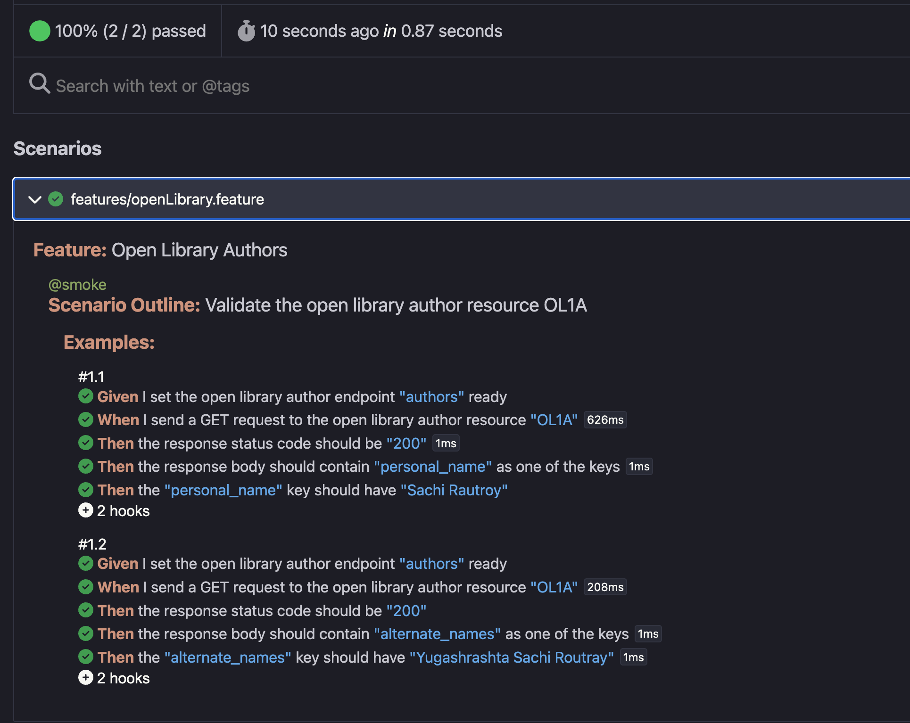

# API Automation of Open Library - Author - OL1A using Playwright with BDD using cucumber.js

## To automate the process of fetching and asserting the response body

## Technology stack

1. Cucumber.js for BDD as the test runner
2. @playwright/test for assertions
3. Javascript as the programming language
4. Node
5. Cucumber-html-report

## Project Structure

features - .feature file
fixtures - .fixture.js file
steps - steps.js file
support - hooks.js
cucumber.js
package.json
README.md

## Installation

npm install -D @cucumber/cucumber
npm install -D @playwright/test

## Features

The endpoint https://openlibrary.org/authors/OL1A.json is triggered with a GET request
The status code is checked for 200 OK
The response body is validated for the following details:

- personal_name to be Sachi Rautroy,
- alternate_names to contain Yugashrashta Sachi Routray

## Running Tests with Tags

npx cucumber-js --tags @smoke

## CI/CD Integration

Github Actions

## Reporting

reports/report.html

